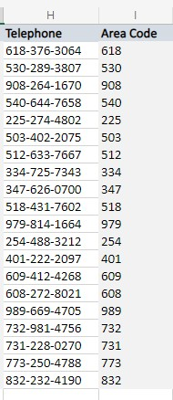
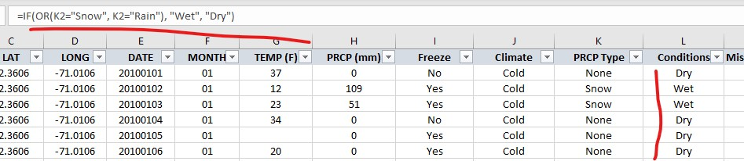
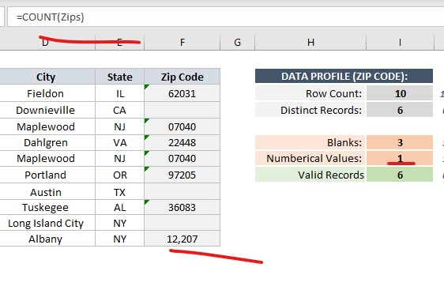
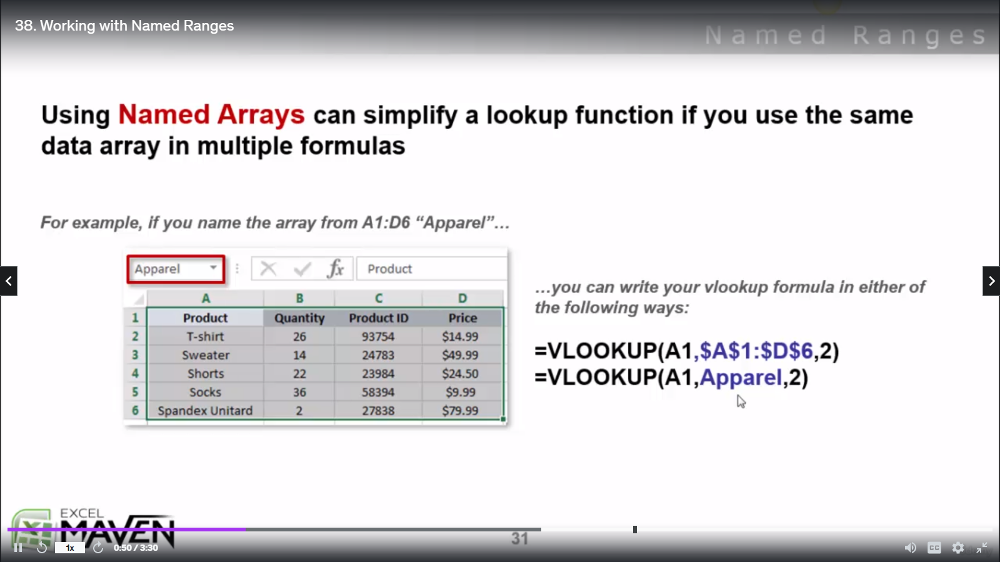

# Excel Formulas & Functions

[MATCH FUNCTION](#Match-Function)

[YEAR FUNCTION](#YEAR-FUNCTION)

[LEFT FUNCTION](#LEFT-FUNCTION)

[Reference Types](#reference-types)

[Excel Error Types](#Excel-Error-Types)

[Navigating Excel Workbook with Ctrl Shortcuts](#Navigating-Excel-Workbook-with-Ctrl-Shortcuts)

[Create DropDown Menu with Data Validation](#Create-DropDown-Menu-with-Data-Validation)

[Logical Operators](#Logical-Operators)

[Basic Statistics Function](#Basic-Statistics-Function)

[Lookup and Reference Functions](#Lookup-and-Reference-Functions)

[HLOOKUP & VLOOKUP](#HLOOKUP-&-VLOOKUP)

# Excel Formula Syntax

## MATCH FUNCTION

## YEAR FUNCTION

- fetching year from a column and populating them in a new column.

- Hetre v want to populate the birthyear field with year value of the birthdate column.
- to do that, we use YEAR() and pass the birthdate column as an argument.
Eg: =YEAR(F2), =YEAR(F3) etc.

    - F2 means column F row 2.
    - F3 means column F row 3.

- Once filling one column, we just drag till the last column and then double click on the column. OR DOUBLE CLICK ON THE RIGHT BUTTOM EDGE OF THE COLUMN.

- Result looks like this:

**[⬆ Back to Top](#Excel-Notes)**
## LEFT FUNCTION

- Here in Area Code column, we have to fill it with first 3 digits of the telephone number.

### Formula:

**=LEFT(H2, 3)**

    - Fetching the left most character from a column and populating them in a new column.
    - H2 means column H row 2.
    - 3 means fetching the first 3 characters.

### Formula:

**=LEFT(J3, FIND("@", J3)-1)**

    - Fetching the left most character from a column and populating them in a new column.
    - J3 means column J and row 3.
    - FIND("@", J3)-1 means fetching the first character before the @ character.

**[⬆ Back to Top](#Excel-Notes)**

# Reference Types

## Problem Statement

What is the starting balance for the given 10 years ?

Aim is to find the starting balance for the given 10 years.

### Formula:

**Sample:**

1000 + (1000 * (1 + 0.05) ^ 10)

    - 1000 is the starting balance.
    - (1 + 0.05) ^ 10 is the interest rate.
    - 10 is the number of years.

### Excel Formula:

    **=D4*(1+$C4)**

    - D4 means column D row 4.
    - C4 means column C row 4.
    - $ means the column is a reference type, that column is fixed one while computation.

- find 8% of the 1000, then add the result with 1000.
- Again find 8% of the result, then add the result of previous output.

### Final Result:

**[⬆ Back to Top](#Excel-Notes)**
# Excel Error Types

## Type 1

Error - ######

## Type 2

Error - #NAME?

- This error occurs when we misspell the formula function.
- For example, we misspelled the function as LET instead of LEFT.

## Type 3

Error - #VALUE!

- This error occurs when we perform an arithmetic operation on text strings.
- For example, we perform an arithmetic operation on a string.
- For example, we perform an arithmetic operation on a date.

## Type 4 (#DIV/0!)

## Type 5 (#REF!)

It is a reference error.
**#REF!** error happens when we delete any important columns or rows from our sheets.

### Screenshots

- We will delete the Growth Rate column and then try to perform the formula.
- As a result of this all columns will be filled with #REF! error.

- All the cells linked with the Growth Rate column will be filled with #REF! error.

## Type 6 (#N/A)

- This error mostly occurs when we search for a match in a record and sadly we don't find any match. This is N/A error.

**[⬆ Back to Top](#Excel-Notes)**
# Formula Auditing: Trace Precedent & Dependents

# Navigating Excel Workbook with Ctrl Shortcuts

**Ctrl + A** - Jumps to last cell in a data region, in the direction of arrow.

**Ctrl + Shift + Arrow** - Selects to the last cell in a data region, in the direction of the arrow.

**Ctrl + Home/End** - Jumps to the Home(top-left) and End(bottom-right) cell in a data region.

**Ctrl + .**  - Jumps Straight to each corner within a selected cell range.

**Ctrl + PageUP/PageDown** - Switches worksheet tabs, either to left or right.

## Examples:

**Ctrl + Shift + Down Arrow** - To select to the last cell in a column.

**[⬆ Back to Top](#Excel-Notes)**
## Function Shortcuts

### F1
    - Launches the help window.
    - Links to the microsoft support

### F2
    - Allows you to edit the active cell.
    - Highlights cells referenced by active formula.

### F4
    - Repeats the last action takes.
    - Toggles absolute/relative cell reference with a formula.

### F9
    - Calculates all workbook formulas.
    - Evaluates each function argument within the formula bar.

**[⬆ Back to Top](#Excel-Notes)**
# Create DropDown Menu with Data Validation

- Choose Data Validation from the menu bar.
- Set validation criteria

    **Allow:** List

    **Source:** List of values

**[⬆ Back to Top](#Excel-Notes)**

## Excel Exercise - 1

### 1. Division in Excel

The simplest way to suppress the #DIV/0! error is to use the IF function to evaluate the existence of the denominator. If it’s a 0 or no value, then show a 0 or no value as the formula result instead of the #DIV/0! error value, otherwise calculate the formula.

For example, if the formula that returns the error is =A2/A3, use =IF(A3,A2/A3,0) to return 0 or =IF(A3,A2/A3,””) to return an empty string. You could also display a custom message like this: =IF(A3,A2/A3,”Input Needed”). With the QUOTIENT function from the first example you would use =IF(A3,QUOTIENT(A2,A3),0). This tells Excel IF(A3 exists, then return the result of the formula, otherwise ignore it).

**[⬆ Back to Top](#Excel-Notes)**

# Logical Operators

## Anatomy of IF Statement  

**[⬆ Back to Top](#Excel-Notes)**
## IF Statement Example:

- Fill the Freeze column with Yes or No values.
- Check the if condition we wrote
- If the temparature is less than 32, then we add **Yes** as value otherwise we add **No**. 

**[⬆ Back to Top](#Excel-Notes)**

## Nesting IF Statements

### Example:

Description:

- If temparature < 40 then add value Cold to cell, else
we check for other if condition and if temperature > 80, then add Hot to cell else add value Mild.
 

**[⬆ Back to Top](#Excel-Notes)**

## Additonal Conditional AND/OR Operators

### AND OPERATOR 

**[⬆ Back to Top](#Excel-Notes)**

### OR OPERATOR

### NOT OPERATOR

#### NOT Operator Example-

**[⬆ Back to Top](#Excel-Notes)**
## Fixing errors with IFERROR 

- Set a new value and replace the NA error.

### Example for IFERROR:

- Here if the value returns an error, we replace the error with "Other" in the column cell.

**[⬆ Back to Top](#Excel-Notes)**

## Common IS Statements

### Example - IS Statements

- Check whther the temparature column has blank values or errors.
- We use the **ISBLANK** function to check for blank values.
- We use the **ISERROR** function to check for ERROR values.
- Formula
    **=OR(ISERROR(G2), ISBLANK(G2))**
    

**[⬆ Back to Top](#Excel-Notes)**

# Basic Statistics Function

## RANK Function, LARGE/SMALL Function

**Example 1**:

if we want to find 10th highest salary from an array of salaries, we can use the LARGE function.

Syntax:

    =LARGE(array,10)

**Example 2**:

If we want to find 10th lowest salary from an array of salaries, we can use the LARGE function.

Syntax:

    =SMALL(array,10)

**Example 3**:

Q. Find the rank of each salary in the array of salaried.

Syntax:

    =RANK(E2, $E$2:$E$4135)

    Here, 
    E2 is the salary column cell for which we have to obtain the rank.
    $E$2:$E$4135 is the range of the array of salaries.

Similary we find the rank of other salary columns cells.

**Key Shortcuts:**

    CTRL + SHIFT + DOWN ARROW -> Selects to the last cell in a data region, in the direction of the arrow.

## PERCENTRANK Function

**Example:**

Q. Find the percentage rank of each salary in the array of salaries.

    ==PERCENTRANK($F$2:$F$4135, F2)

    Here, 
    F2 is the rank cell for which we have to obtain the percentage rank.
    $F$2:$F$4135 is the range of the array of salaries. 

**[⬆ Back to Top](#Excel-Notes)**

## SUMPRODUCT Function

## SUMPRODUCT Function Advanced

### Example:

**Find total shipping cost ?**

## Conditional Aggregation with COUNTIF, SUMIF, AVERAGEIF Functions

**[⬆ Back to Top](#Excel-Notes)**

## Build a Dashboard With COUNTIF, SUMIF, AVERAGEIF Functions

### **Total Salary is**
    =SUMIFS('Salary Data'!$E:$E, 'Salary Data'!$B:$B, 'Team Salary Dashboard'!$C$2, 'Salary Data'!$A:$A, 'Team Salary Dashboard'!$B5)

### **Count of Players**
    =COUNTIFS('Salary Data'!$B:$B, 'Team Salary Dashboard'!$C$2, 'Salary Data'!$A:$A, 'Team Salary Dashboard'!$B5)

## Data Profiling with COUNT & SUMPRODUCT Functions

### ROW Function
- **Counting rows in a sheet**

    = ROW(array)

### COUNTBLANK Function
- **Counting blank columns in a column**

    =COUNTBLANK(array)

### COUNT Function
- **Counting numerical values in a column**

    =COUNT(array)

### COUNTIF Function
- **Counting valid records in a column**

    =COUNTIF(array, "*")

### SUMPRODUCT Function
- **Counting distinct records in a column**

    =SUMPRODUCT((Zips<>"")/COUNTIF(Zips, Zips&""))

# Lookup and Reference Functions

## Named Ranges

- We can set the name for our selected cells.
- We can use the name to refer to the selected cells.

**Demo:**

* In the above screenshot, we can see the name of the named range is "Fielding".
* We can view thee name by selecting the name in the "Named Manager" tab under "Formulas".

## ROW & ROWS Functions

**Demo:**

## COLUMN & COLUMNS Functions

**Demo:**

# HLOOKUP & VLOOKUP

## VLOOKUP FUNCTION

- Generaly used to combine two different arrays having common fields.

**Example:**

In above screenshot, 

- In *Source* array, we have the **Product, Quantity, Product ID and Price**.
- In *Lookup* array, we have the **Product and Price**.
- Common field is **Product**.

we combine both arrays using a common field **Product**.

### **Formula Description**

**VLOOKUP(lookup_value, table_array, col_index_num, [range_lookup])**

        * lookup_value: common field to be used for lookup.
        * table_array: array containing the data to be used for lookup.
        * col_index_num: column index number of the table_array. This is the column number of the field to be used for lookup.
        * range_lookup: optional argument to specify the range of the lookup.
         we can put 0, 1 or False in this argument.

**Task:**

    - Find the price in lookup array and pull the price into the source array ?.

**Solution:**

            D2=VLOOKUP(A2, $G1:$H5, 2, 0)

    - In cell D2 of the source array, we created a Price column.
    - Pass A2 as the lookup_value,
    - Pass $G1:$H5 as the table_array containing the data to be used for lookup,
    - Pass 2 as the col_index_num, since this column contains the price value we are looking for.
    - Pass 0 as the range_lookup, since we are not looking for a range.
    - Finally Price column in Source array will be populated with the price value from the lookup array.

## HLOOKUP FUNCTION

    - Generaly used to combine two different arrays having common fields.
    - Used if table arrays are transposed.

https://www.udemy.com/course/excel-for-analysts/learn/lecture/3429214#content

Time: 3:10

